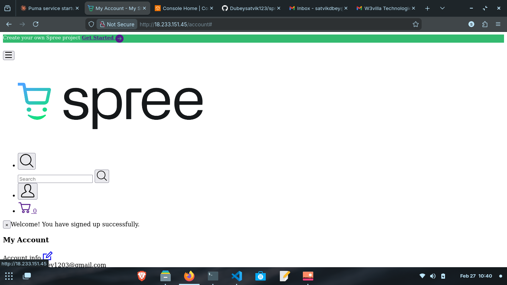
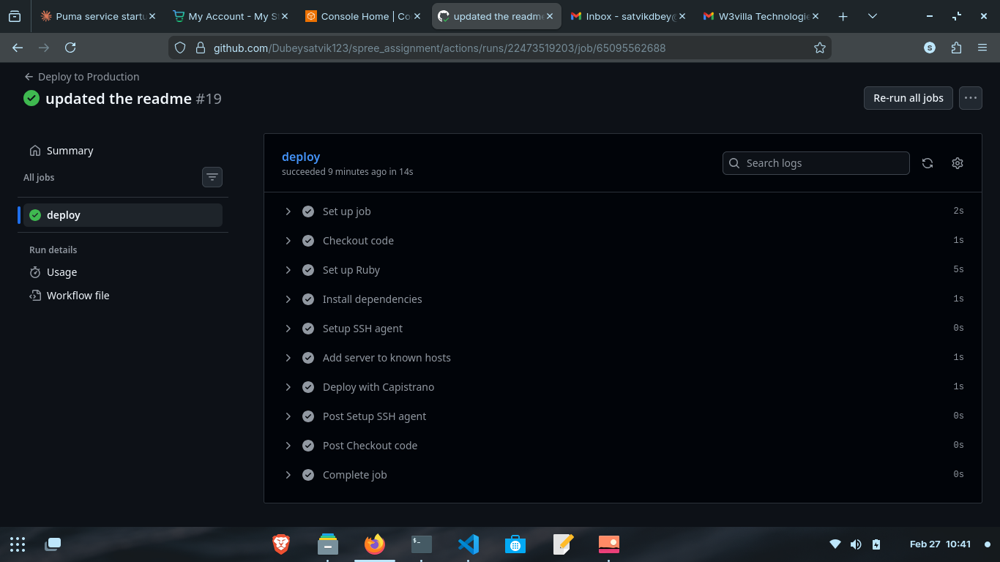
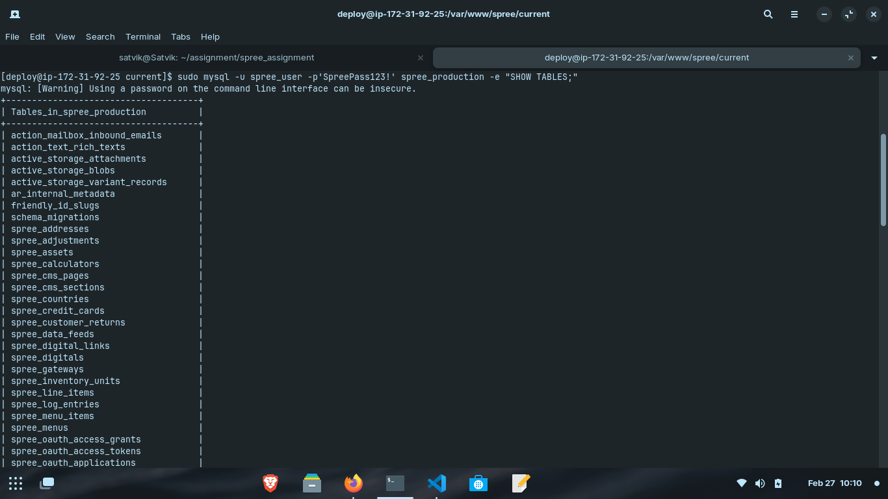

# Spree Commerce Deployment

## Live URL
http://18.233.151.45

## Deployment Steps

1. Clone the repo and install dependencies:
   ```bash
   git clone https://github.com/Dubeysatvik123/spree_assignment.git
   cd spree_assignment
   bundle install
   ```

2. Add shared config files on the server (not committed — secrets):
   ```
   /var/www/spree/shared/config/database.yml
   /var/www/spree/shared/config/master.key
   ```

3. Deploy using Capistrano:
   ```bash
   bundle exec cap production deploy
   ```

## CI/CD Overview

On every push to `master`, GitHub Actions automatically:
- Sets up Ruby and installs gems
- SSHs into the EC2 server using a stored deploy key
- Runs `cap production deploy` — pulls latest code, runs migrations, precompiles assets, and restarts Puma

**Required GitHub Secrets:**
| Secret | Description |
|--------|-------------|
| `EC2_HOST` | Server IP address |
| `EC2_SSH_KEY` | Private SSH key for the deploy user |

## Screenshots

### Running Application


### GitHub Actions – Successful Deploy



### MYSQL Database tables - All tables successfully migrated

